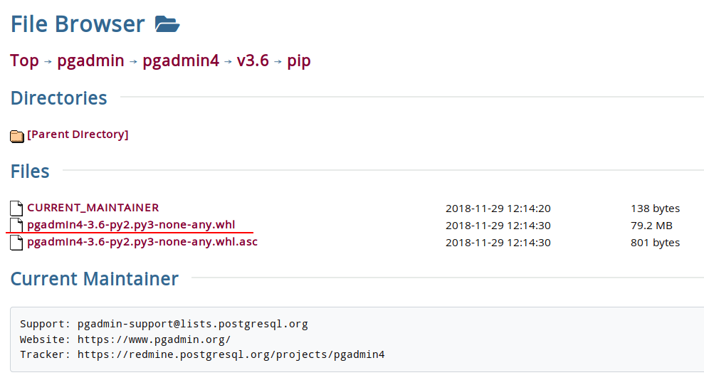

Установка pgAdmin4 в Deepin linux
=================================

Кроссплатформенное приложение **pgAdmin 4** является одним из клиентов, предназначенных для серверов **PostgreSQL**. С помощью **pgAdmin** очень удобно администрировать сервера **PostgreSQL**, а так же создавать базы данных. **pgAdmin 4** основан на Python и по сути запускает на компьютере свой веб серер на порту 5050.

Однако для установки на Debian/Ubuntu нет готовых deb пакетов и это требует некоторых усилий для его установки.

Установка pgAdmin 4
-------------------

1. Сначала необходимо обновить кэш и установить необходимые для запуска **pgAdmin 4** пакеты:

.. code-block:: console

   $ sudo apt update
   $ sudo apt install build-essential libssl-dev libffi-dev libgmp3-dev \
                      virtualenv python-pip libpq-dev python-dev

2. Теперь необходимо создать виртуальное окружение

.. code-block:: console

   $ cd ~
   $ virtualenv pgadmin4
   $ cd pgadmin4

3. Теперь необходимо активировать виртуальное окружение

.. code-block:: console

   $ source bin/activate

4. Подготовительные операции произведены, теперь нужно скачать последнюю версию приложения. На момент написания статьи - это версия ``pgadmin4-3.6``. Чтобы скачать, переходим по ссылке_.

.. _ссылке: https://www.postgresql.org/ftp/pgadmin/pgadmin4/v3.6/pip/

5. Копируем в буфер обмена ссылку на файл ``pgadmin4-2.1-py2.py3-none-any.whl`` и загружаем при помощи ``wget`` или ``curl`` в созданную директорию ``pgadmin4``.

.. code-block:: console

   $ wget https://ftp.postgresql.org/pub/pgadmin/pgadmin4/v3.6/pip/pgadmin4-3.6-py2.py3-none-any.whl

6. И теперь, собственно, установка **pgAdmin 4**

.. code-block:: console

   $ pip install pgadmin4-3.6-py2.py3-none-any.whl

7. После установки необходимо создать конфигурационный файл:

.. code-block:: console

   $ nano lib/python2.7/site-packages/pgadmin4/config_local.py

И записать в него следующее содержимое:

.. code-block:: python
   :linenos:

   import os
   DATA_DIR = os.path.realpath(os.path.expanduser(u'~/.pgadmin/'))
   LOG_FILE = os.path.join(DATA_DIR, 'pgadmin4.log')
   SQLITE_PATH = os.path.join(DATA_DIR, 'pgadmin4.db')
   SESSION_DB_PATH = os.path.join(DATA_DIR, 'sessions')
   STORAGE_DIR = os.path.join(DATA_DIR, 'storage')
   SERVER_MODE = False

8. Собственно после этого можно заустить **pgAdmin 4** командой:

.. code-block:: console

   $ python lib/python2.7/site-packages/pgadmin4/pgAdmin4.py

.. note:: В моём случае постребовалось доустановить ещё несколько модулей *python*. Полный список приведён ниже.

.. code-block:: console

   $ pip install flask-htmlmin flask-babelex flask-login flask-mail \
                 flask-paranoid flask-security flask-gravatar flask-sqlalchemy \
                 flask-migrate backports.csv sshtunnel sqlparse psycopg2-binary

.. tip:: На мой взгляд, запускать **pgAdmin 4** приведённой выше командой не учень удобно. Поэтому я создал в домашней директории папку ``bin`` и добавил в неё скрипт для запуска **pgAdmin**

.. code-block:: console

   $ mkdir ~/bin
   $ echo python ~/pgadmin/lib/python2.7/site-packages/pgadmin4/pgAdmin4.py > ~/bin/pgadmin

После создания файла достаточно перезайти в эмулятор терминала и можно пробовать запускать программу:

.. code-block:: console

   $ pgadmin

Если всё запускается без ошибок, то мы увидим что-то подобное:

Как видно из сообщения, которое вывел скрипт, интерфейс **pgAdmin 4** доступен в броузере по адресу ``http://127.0.0.1:5050``. Копируем ссылку, открываем броужен и переходим по этому адресу:

Удаление pgAdmin 4
------------------

Чтобы удалить pgAdmin, нужно выполнить следующие команды:

1. Перейти в директорию ``pgadmin4``

.. code-block:: console

   $ cd ~/pgadmin4

2. Активировать виртуальное окружение

.. code-block:: console

   $ source bin/activate

3. Удалить **pgAdmin 4**

.. code-block:: console

   $ pip uninstall pgadmin4

После запуска комманда выдаст список удаляемых файлов и попросит подтвердить удаление:

.. code-block:: console

   Uninstalling pgadmin4-3.6:
     Would remove:
       /home/mdima/pgadmin4/lib/python2.7/site-packages/pgadmin4-3.6.dist-info/*
       /home/mdima/pgadmin4/lib/python2.7/site-packages/pgadmin4/.editorconfig
       /home/mdima/pgadmin4/lib/python2.7/site-packages/pgadmin4/.eslintignore
       /home/mdima/pgadmin4/lib/python2.7/site-packages/pgadmin4/.eslintrc.js
       /home/mdima/pgadmin4/lib/python2.7/site-packages/pgadmin4/.pycodestyle
       ...
       /home/mdima/pgadmin4/lib/python2.7/site-packages/pgadmin4/webpack.test.config.js
       /home/mdima/pgadmin4/lib/python2.7/site-packages/pgadmin4/yarn.lock
   Proceed (y/n)? y
     Successfully uninstalled pgadmin4-3.6
   (pgadmin4)

4. Осталось только деактивировать виртуальное окружение.

.. code-block:: console

   deactivate

На этом всё.

.. image:: https://readthedocs.org/projects/mylittlewiki/badge/?version=latest
   :target: https://mylittlewiki.readthedocs.io/ru/latest/?badge=latest
   :alt: Documentation Status
