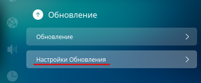
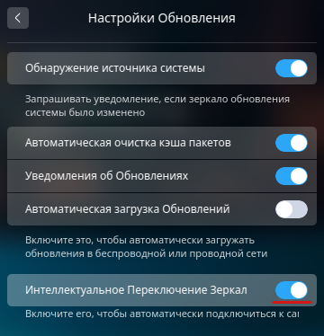

Изменение зеркала обновления Deepin linux
=========================================

Как правило после установки Deepin linux зеркалом обновления пакетов по-умолчанию назначается основной репозиторий, находящийся в Китае. И хотя в последней версии (на момент написания это версия 15.8) появилась опция автоматического подключения к самому быстрому зеркалу, но на практике это не всегда происходит и обновления скачиваются с основного репозитория с невысокой скоростью загрузки.

Есть два варианта сменить зеркало обновления Deepin linux:

Изменение зеракла обновлений через *Центр управления*
-----------------------------------------------------

1. Необходимо зайти в раздел *Центра управления* -> *Обновление* -> *Настройки обновления*

2. Отключить *Интеллектуальное обновление зеркал*

3. После отключения *Интеллектуального обновления зеркал* ниже появится новый пункт *Переключить зеркало*

.. image:: .images/mirror-03.png
   :alt: Переключить зеркало
   :align: center

4. Заходим в раздел *Переключить зеркало* и нажимаем кнопку *Тест скорости*, чтобы определить наоболее подходящее зеркало.

5. После теста, выбираем одно из зеркал у которых будет написано *быстро*

На этом настройка нового зеркала обновлений закончена. Остаётся только обновить кэш пакетов.

.. code-block:: console

   sudo apt update

Изменение зеркала обновлений непосредственно в файле ``sources.list``
---------------------------------------------------------------------

Все действия необходимо выполнять от имени ``root`` или через команду ``sudo``

1. Сохраним оригинал файла ``sources.list``

.. code-block:: console

   sudo cp /etc/apt/sources.list /etc/apt/sources.list.original

2. Открываем файл ``sources.list`` в любимом текстовом редакторе:

.. code-block:: console

   sudo nano /etc/apt/sources.list

и добавляем в него новое зеркало. Старые записи коментируем.

.. code-block:: bash

   ## Generated by deepin-installer
   # deb [by-hash=force] http://packages.deepin.com/deepin panda main contrib non-free
   # deb-src http://packages.deepin.com/deepin panda main contrib non-free
   deb http://mirror.inode.at/data/deepin panda main contrib non-free

3. Сохраняем файл и обновляем кэш пакетов.

.. code-block:: console

   sudo apt update

Новое зеркало обновлений настроено.

.. note:: После ручного изменения файла ``sources.list`` может выдаваться предупреждение что основной репозиторий изменён с предложением переключиться на репозиторий по-умолчанию. Чтобы такое предупреждение не появлялось, необходимо в *Центр управления* -> *Обновление* отключить *Обнаружение источника системы*

.. image:: https://readthedocs.org/projects/mylittlewiki/badge/?version=latest
   :target: https://mylittlewiki.readthedocs.io/ru/latest/?badge=latest
   :alt: Documentation Status
