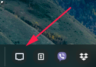
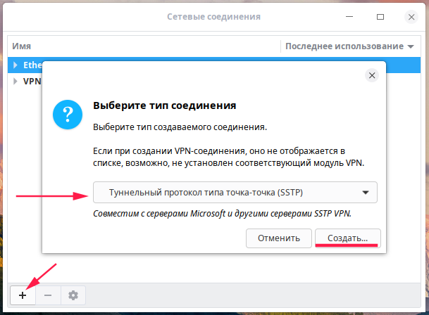
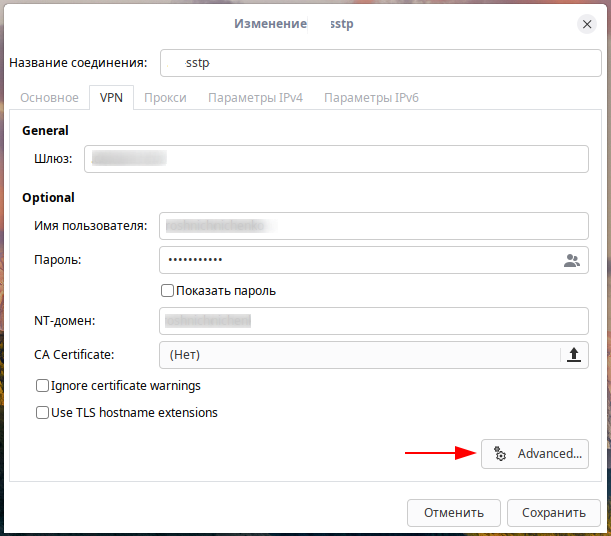
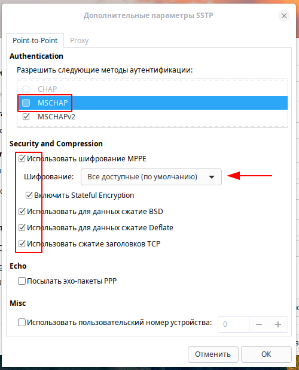
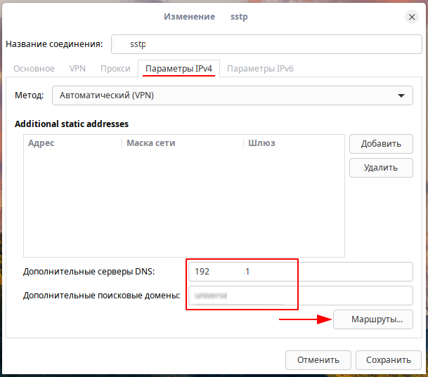
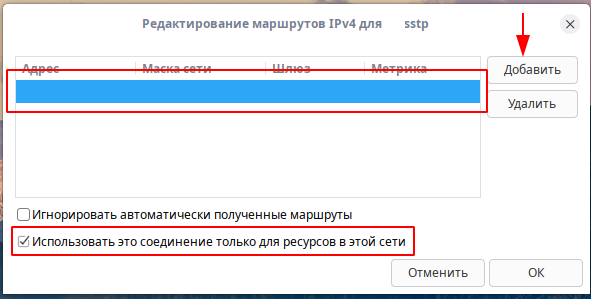
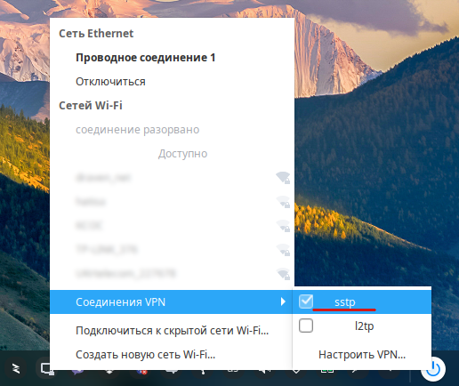
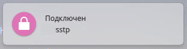
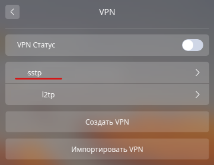

Настройка SSTP VPN в Deepin Linux
=================================

К сожалению, **Deepin Linux** не поддерживает настройку *SSTP VPN* "из коробки". В *Центре управления*, после установки системы (версия системы на момент написания 15.8), доступно несколько вариантов подключения VPN (*L2TP, PPTP, VPNC, OpenVPN, StrongSwan, OpenConnect*), но недоступно *SSTP*. Для того, чтобы настроить подключение *SSTP VPN*, необходимо установить пакеты ``network-manager-gnome`` и ``sstp-client`` из PPA-репозитория.

Установка необходимых пакетов
-----------------------------

1. Добавляем в систему ключ репозитория:

.. code-block:: console

   sudo apt-key adv --keyserver keyserver.ubuntu.com --recv-keys 61FF9694161CE595

2. Создаём файл ``/etc/apt/sources.list.d/sstp-client.list`` при помощи любого редактора текстовых файлов, будь то ``vi`` или ``nano``:

.. code-block:: console

   sudo nano /etc/apt/sources.list.d/sstp-client.list

3. Добавляем в созданный файл две строчки:

.. code-block:: console

   deb http://ppa.launchpad.net/eivnaes/network-manager-sstp/ubuntu xenial main
   deb-src http://ppa.launchpad.net/eivnaes/network-manager-sstp/ubuntu xenial main

4. Обновляем кеш ``apt``:

.. code-block:: console

   sudo apt update

Если в процессе обновления возникает ошибка *"dirmngr not found"*, то устанавливаем дополнительно пакет ``dirmngr``:

.. code-block:: console

   sudo apt install dirmngr

5. Далее, устанавливаем пакеты ``network-manager-gnome`` и ``sstp-client``:

.. code-block:: console

   sudo apt install network-manager-gnome sstp-client

6. Теперь осталось запустить апплет *NetworkManager* из консоли.

.. code-block:: console

   nm-applet &

Поскольку *SSTP* не поддерживается оболочкой **Deepin Desktop Envirement**, настройку подключения необходимо производить из стандартного Гномовского *NetworkManager*.
После запуска из консоли он будет доступен в области уведомлений (в трее).

Настройка подключения
---------------------

Все необходимые пакеты установлены. Теперь можно приступать к настройке подключения.

1. Нажимаем на появившийся в трее после запуска аплета ``nm-applet`` значёк сетевых подключений и *Соединения VPN* -> *Настроить VPN*

2. В появившемся окне нажимаем на |плюс| и выбираем тип протокола VPN подключения.

3. Прописываем *Шлюз*, *Имя*, *Пароль* и *NT-домен*. Переходим к Дополнительным настройкам (кнопка *Advenced*).

4. Настраиваем дополнительные параметры SSTP подключения и сохраняем.

5. Далее, переходим на вкладку *Параметры IPv4* и прописываем DNS серверы и поисковые домены.

6. Добавляем маршрут.

7. Сохраняем сделанные изменения. Теперь можно, аконец-то, попробовать созданное VPN соединение.

Если всё настроено правильно, то на рабочем столе появится оповещение об успешном подключении.

.. hint:: После настройки, SSTP подключение становится доступно так же и через *Центр управления*. Достаточно зайти в раздел *Сеть* -> *VPN*

На этом всё.

.. image:: https://readthedocs.org/projects/mylittlewiki/badge/?version=latest
   :target: https://mylittlewiki.readthedocs.io/ru/latest/?badge=latest
   :alt: Documentation Status
